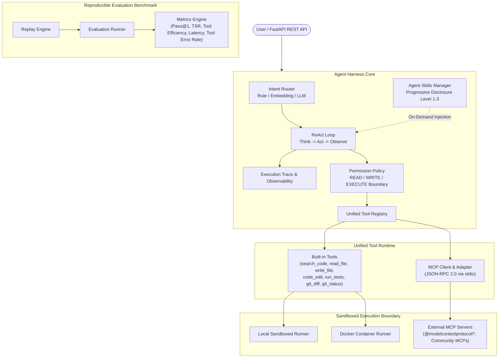

# CodePilot Agent

[](https://github.com/YANS311/CodePilot-Agent/actions/workflows/ci.yml)
[](https://www.python.org/downloads/)
[](https://opensource.org/licenses/MIT)

> **A lightweight and extensible Coding Agent Harness built with Python, featuring ReAct orchestration, unified tool runtime, MCP integration, Agent Skills, sandboxed execution and reproducible evaluation.**

---

## 1. System Architecture

CodePilot Agent decouples the orchestration harness from external capabilities and environment execution. Built-in tools and Model Context Protocol (MCP) servers share a polymorphic execution contract, while procedural domain workflows are dynamically injected via progressive Agent Skills.



---

## 2. Core Capabilities

### 2.1 Agent Runtime & ReAct Loop
- **Iterative Reasoning Loop**: Systematic `Think -> Act -> Observe` cycle with dynamic prompt budget control (`ToolBudget`).
- **Fake Tool Call & Completion Drift Recovery**: Real-time trajectory heuristic detection preventing hallucinated inline tool outputs or false "done" declarations without modifying code.
- **Automated Self-Verification**: Post-write execution loop automatically triggers targeted test suites and injects test assertion failures back into context for iterative self-healing.

### 2.2 Unified Tool System (Built-in + MCP)
- **Polymorphic Contract**: All tools inherit from `BaseTool`, implementing `to_openai_schema()` and `run(workspace_root, **kwargs)`.
- **MCP Client Adapter**: Implements the Model Context Protocol (JSON-RPC 2.0 over `stdio`), dynamically discovering tools, converting JSON Schemas to OpenAI function schemas, and mounting seamlessly into `ToolRegistry`.
- **Namespace & Failure Isolation**: Server crashes, malformed responses, and protocol timeouts are caught and reported as structured errors without crashing the main agent harness.

### 2.3 Agent Skills System (Progressive Disclosure)
- **Procedural Knowledge Separation**: Distinction between *Tools* (what the agent can execute) and *Skills* (how the agent should approach a domain task step-by-step).
- **Three-Tier Progressive Disclosure**:
  - **Level 1 (Metadata Discovery)**: System prompt indexes only names and summaries (<100 tokens).
  - **Level 2 (Instruction Loading)**: Full `SKILL.md` procedural guidelines are loaded on-demand when relevant task intent is matched.
  - **Level 3 (Resource Loading)**: Associated reference manuals, scripts, and examples are fetched strictly on explicit need.

### 2.4 Sandboxed Execution & Security Boundaries
- **Deterministic Permission Policy**: Hard enforcement of `READ`, `WRITE`, `EXECUTE`, `NETWORK`, and `GIT_MUTATE` actions in `ToolRegistry` (Prompt Guardrail != Security Boundary).
- **Execution Runners**: Pluggable `LocalRunner` (subprocess isolation with workspace confinement) and `DockerRunner` (isolated container sandbox).
- **Path Traversal Blocking**: Strict `safe_resolve` validation preventing directory escape (`../`) across all native tools and MCP adapters.

### 2.5 Reproducible Evaluation Framework
- **Quantitative Benchmark Metrics**: Task Success Rate (TSR), Pass@1, Tool Efficiency, Latency (ms), Tool Error Rate, and Error Taxonomy distribution.
- **Multi-Layer Task Suite**: 30 synthetic benchmarks + 15 real-world repository tasks + 10 stress/recovery test cases.
- **Deterministic Replay**: Recorded `ExecutionTrace` trajectories allow exact replay and step-level regression debugging.

---

## 3. Quick Start

### 3.1 Setup Environment

```bash
# Clone repository
git clone https://github.com/YANS311/CodePilot-Agent.git
cd CodePilot-Agent

# Install dependencies
pip install -r requirements.txt
```

### 3.2 Configure MCP Servers (`mcp.json`)

Declare community or custom MCP servers in the root `mcp.json`:

```json
{
  "mcpServers": {
    "filesystem": {
      "transport": "stdio",
      "command": "npx",
      "args": ["-y", "@modelcontextprotocol/server-filesystem", "./workspace"],
      "timeout": 30.0
    },
    "memory": {
      "transport": "stdio",
      "command": "npx",
      "args": ["-y", "@modelcontextprotocol/server-memory"],
      "timeout": 15.0
    }
  }
}
```

Load MCP configuration programmatically:

```python
from app.mcp.registry import MCPRegistry
from app.tools.registry import ToolRegistry

mcp_registry = MCPRegistry()
mcp_registry.load_from_json("mcp.json")
await mcp_registry.start_all()

tool_registry = ToolRegistry()
mcp_registry.mount_to_tool_registry(tool_registry)
print(f"Loaded tools: {[t.name for t in tool_registry.list_tools()]}")
```

### 3.3 Adding a Custom Agent Skill (`skills/<name>/SKILL.md`)

Create a skill directory with a standard YAML frontmatter contract:

```markdown
---
name: bug-fix
description: Diagnose and fix reproducible software defects following systematic verification.
version: 1.0.0
tags: [debugging, bug-fix, verification]
---

# Procedural Knowledge: Bug Fixing Workflow
1. Reproduce & Observe: Run tests to observe failure trace.
2. Root Cause Analysis: Use search_code and read_file.
3. Minimal Surgical Patch: Modify code with code_edit.
4. Targeted Verification: Re-run test suite to confirm pass.
5. Regression Check: Inspect git_diff.
```

The `SkillManager` automatically indexes Level 1 metadata and loads Level 2 instructions when a bug-fix task is dispatched:

```python
from app.skills.manager import skill_manager

matched_skill = skill_manager.match_and_load_for_task("Fix failing test in calculator subtract method")
print(f"Active skill: {matched_skill.name}")
```

### 3.4 Running the Test Suite

```bash
# Run unit & integration tests
pytest tests/unit tests/integration -q --tb=short

# Verify specific modules
pytest tests/unit/test_skills.py tests/unit/test_permission.py tests/unit/test_mcp_config.py -v
```

---

## 4. Repository Structure

```text
CodePilot-Agent/
├── app/
│   ├── agent/                 # Core Agent runtime (ReAct loop, prompts, budget, trace)
│   │   ├── react_agent.py     # ReAct Agent orchestrator & verification loop
│   │   ├── trace.py           # Structured execution trace & observability
│   │   ├── budget.py          # Tool call budget & anti-loop controller
│   │   └── verification.py    # Self-verification policy & retry engine
│   ├── core/                  # Core config, LLM client abstraction & kernel
│   ├── execution/             # Sandboxed execution runners (LocalRunner, DockerRunner)
│   ├── evaluation/            # Benchmark runner, metrics computation & replay
│   ├── mcp/                   # Model Context Protocol client & registry
│   │   ├── client.py          # Stdio JSON-RPC transport & protocol client
│   │   ├── registry.py        # MCP server manager & MCPTool adapter
│   │   └── server.py          # Reference builtin stdio MCP server
│   ├── models/                # ToolCall, ToolResult, AgentStep models
│   ├── router/                # 3-layer hybrid intent router
│   ├── security/              # PermissionPolicy & ToolGuardrail
│   │   ├── permission.py      # Runtime permission action enforcement
│   │   └── tool_guardrail.py  # Path traversal & prompt security guards
│   ├── skills/                # Agent Skills system (Progressive Disclosure)
│   │   ├── models.py          # Skill & SkillMetadata data contracts
│   │   ├── loader.py          # YAML frontmatter scanner & resource loader
│   │   ├── selector.py        # Task intent to skill matcher
│   │   └── manager.py         # Runtime skill lifecycle manager
│   ├── tools/                 # Built-in developer tools (BaseTool implementations)
│   └── workspace/             # Workspace indexer, resolver & cache
├── skills/                    # Built-in standard coding skills
│   ├── bug-fix/SKILL.md       # Defect diagnosis & verification workflow
│   ├── code-review/SKILL.md   # Quality & security audit workflow
│   └── test-debugging/SKILL.md# Flaky & failing test isolation workflow
├── benchmarks/                # Synthetic & real-world evaluation tasks
├── mcp.json                   # Standard MCP server declarations
├── pyproject.toml             # Pytest & project build configuration
└── tests/
    ├── unit/                  # Fast deterministic unit tests (500+ tests)
    └── integration/           # MCP, runner & API integration tests
```

---

## 5. Architectural Design Decisions

### 5.1 Why MCP (Model Context Protocol)?
Rather than maintaining ad-hoc proprietary integrations for every external developer service (GitHub, databases, memory stores, documentation search), MCP provides an open, standardized JSON-RPC protocol. CodePilot acts as an **MCP Client**, allowing developers to connect any community MCP server via simple JSON configuration without modifying agent core code.

### 5.2 Why Skills vs. Tools?
- **Tools** are *Actions/Capabilities*: They define *what* operations the agent can execute in the physical environment (`read_file`, `write_file`, `run_tests`).
- **Skills** are *Procedural Knowledge*: They define *how* an experienced engineer structures problem-solving steps (e.g. reproduce -> isolate -> minimal patch -> verify -> diff check).

### 5.3 Why Progressive Disclosure?
Injecting dozens of complete tool manuals and workflows into the system prompt at startup causes severe context window bloat, increases inference costs, and dilutes model attention. Progressive Disclosure exposes only lightweight Level 1 summaries (<100 tokens) initially, dynamically fetching Level 2 instructions only when relevant, and loading Level 3 reference files strictly on explicit demand.

### 5.4 Why a Harness instead of a Model Wrapper?
A production Coding Agent cannot rely solely on raw LLM capabilities. The **Harness** layer provides the essential engineering substrate:
1. **Deterministic Safety**: Runtime permission enforcement and workspace sandboxing.
2. **Loop Control & Budgeting**: Detecting duplicate searches, fake tool calls, and loop fatigue.
3. **Traceability**: Step-by-step latency, decision, and error event tracking.
4. **Reproducible Evaluation**: Scientific benchmarking across model iterations.

---

## 6. License

This project is licensed under the MIT License - see the [LICENSE](LICENSE) file for details.
